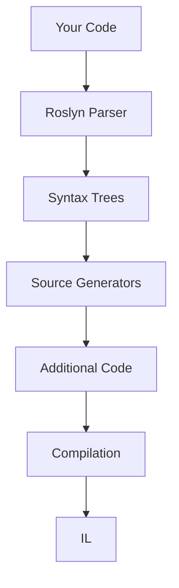

## The Problem: Death by Boilerplate

Every .NET developer has been here. You're building a system with 50 DTOs, and for each one you need:

- A mapper to convert between entities and DTOs
- Validation logic
- Equality comparisons
- `ToString()` overrides for debugging
- JSON serialization hints

That's 5 pieces of boilerplate per class. 250 methods that are 90% identical, differing only in property names. You write them by hand, copy-paste errors creep in, and when a property changes, you forget to update the mapper.

**The traditional solutions all have problems:**

| Approach | Problem |
|----------|---------|
| Reflection (AutoMapper) | Runtime overhead, no compile-time safety |
| T4 Templates | Clunky tooling, poor IDE support, runs pre-build |
| Code snippets | Still manual, still error-prone |
| IL Weaving (Fody) | Post-compilation magic, hard to debug |

Source generators offer a different path: **generate the code at compile time, as if you wrote it yourself**.

## What Source Generators Actually Do

Source generators hook into the Roslyn compiler. They:

1. **Inspect** your code via syntax trees and semantic models
2. **Generate** new C# source files
3. **Add them** to your compilation

The generated code is real C# - visible in your IDE, navigable with "Go to Definition", fully debuggable. There's zero runtime overhead for the generation itself.

Here's how they fit into the build pipeline:



The key difference from reflection: by the time your app runs, the generated code is already compiled. No `Type.GetProperties()`, no `Activator.CreateInstance()`, no JIT compilation of dynamic methods.

## The Code: A Complete Playground Repo

I’ve put all the samples for this post into a runnable playground solution:

**You can access the full sample code here:** [GitHub Repo](https://github.com/animat089/playground/tree/main/SourceGenerators){: .btn .btn--primary}

It includes both Roslyn **source generators** and the equivalent **T4-generated output** (checked in) so you can compare the two approaches.

## What Gets Generated (In This Repo)

The playground focuses on four patterns that show up constantly in real .NET codebases.

### 1) Strongly-Typed Configuration Binding

Define a POCO and mark it:

```csharp
using AnimatLabs.SourceGenerators.Attributes;

namespace AnimatLabs.SourceGenerators.Demo.Models;

[GenerateConfiguration(SectionName = "Database")]
public partial class DatabaseSettings
{
    public string ConnectionString { get; set; } = string.Empty;
    public int Timeout { get; set; } = 30;
    public RetrySettings Retry { get; set; } = new();
}

public class RetrySettings
{
    public int MaxAttempts { get; set; } = 3;
    public int DelayMs { get; set; } = 1000;
}
```

The generator emits `Bind(IConfiguration)` plus nested binders for complex properties.

```csharp
// Generated (shape): DatabaseSettings.Configuration.g.cs
public static global::AnimatLabs.SourceGenerators.Demo.Models.DatabaseSettings Bind(
    global::Microsoft.Extensions.Configuration.IConfiguration configuration)
{
    var section = configuration.GetSection("Database");
    return BindSection_AnimatLabs_SourceGenerators_Demo_Models_DatabaseSettings(section);
}
```

Supported property types: `string`, `int`, `bool`, `double`, `decimal`, enums, and nested classes. Unsupported types are skipped.

### 2) Enum Extensions (Display Names + Parsing)

```csharp
using System.ComponentModel.DataAnnotations;
using AnimatLabs.SourceGenerators.Attributes;

namespace AnimatLabs.SourceGenerators.Demo.Models;

[GenerateEnumExtensions]
public enum OrderStatus
{
    [Display(Name = "Pending Approval")] Pending,
    [Display(Name = "In Progress")] Processing,
    Shipped,
    Delivered,
    Cancelled
}
```

The generator emits:

- `ToDisplayName()` (uses `DisplayAttribute.Name` when present)
- `TryParse(string, out OrderStatus)` (accepts both member name and display name)
- `GetAll()`

### 3) DTO Mapping Without Reflection

```csharp
using AnimatLabs.SourceGenerators.Attributes;
using AnimatLabs.SourceGenerators.Demo.Models;

namespace AnimatLabs.SourceGenerators.Demo.Mappers;

[GenerateMapper]
public partial class UserMapper
{
    public partial UserDto ToDto(User entity);
    public partial User ToEntity(UserDto dto);
}
```

The generator implements each method by assigning properties where **name and type match**.

### 4) Auto-Generated `ToString()`

```csharp
using AnimatLabs.SourceGenerators.Attributes;

namespace AnimatLabs.SourceGenerators.Demo.Models;

[AutoToString]
public partial class Person
{
    public string FirstName { get; set; } = string.Empty;
    public string LastName { get; set; } = string.Empty;
    public int Age { get; set; }
}
```

The generator emits an override using `StringBuilder` (and supports `Exclude` + `IncludePrivate` options).

## How The Playground Generator Is Structured

The repo uses a single incremental generator (`AnimatLabsSourceGenerators`) that registers four independent pipelines using `ForAttributeWithMetadataName(...)`.

### How It’s Wired Into A Consumer Project

The demo project shows the standard setup:

- reference the attributes project normally
- reference the generator project as an analyzer (so it runs at compile time)

```xml
<ItemGroup>
    <ProjectReference Include="..\AnimatLabs.SourceGenerators.Attributes\AnimatLabs.SourceGenerators.Attributes.csproj" />
    <ProjectReference Include="..\AnimatLabs.SourceGenerators\AnimatLabs.SourceGenerators.csproj"
                                        OutputItemType="Analyzer"
                                        ReferenceOutputAssembly="false" />
</ItemGroup>

<PropertyGroup>
    <EmitCompilerGeneratedFiles>true</EmitCompilerGeneratedFiles>
</PropertyGroup>
```

## Debugging and Testing Generators

### View Generated Files

Enable compiler-generated files in the consuming project (the playground demo already does this):

```xml
<PropertyGroup>
    <EmitCompilerGeneratedFiles>true</EmitCompilerGeneratedFiles>
</PropertyGroup>
```

Then inspect `obj/Debug/net8.0/` for the emitted `.g.cs` files.

### Attach Debugger During Build

```csharp
public void Initialize(IncrementalGeneratorInitializationContext context)
{
    #if DEBUG
    if (!Debugger.IsAttached)
    {
        Debugger.Launch();
    }
    #endif
    
    // ... rest of initialization
}
```

### Unit Test Generators Properly

```csharp
using System;
using System.Linq;
using AnimatLabs.SourceGenerators;
using AnimatLabs.SourceGenerators.Attributes;
using Microsoft.CodeAnalysis;
using Microsoft.CodeAnalysis.CSharp;
using Xunit;

public class GeneratorTests
{
    [Fact]
    public void AutoToString_GeneratesOverride()
    {
        var source = """
            using AnimatLabs.SourceGenerators.Attributes;
            namespace Demo;

            [AutoToString]
            public partial class Person
            {
                public string Name { get; set; } = string.Empty;
            }
            """;

        var output = RunGenerator(source);

        Assert.Contains("public override string ToString()", output, StringComparison.Ordinal);
        Assert.Contains("Name =", output, StringComparison.Ordinal);
    }

    private static string RunGenerator(string source)
    {
        var syntaxTree = CSharpSyntaxTree.ParseText(source, new CSharpParseOptions(LanguageVersion.Latest));

        var references = AppDomain.CurrentDomain.GetAssemblies()
            .Where(assembly => !assembly.IsDynamic)
            .Select(assembly => assembly.Location)
            .Where(location => !string.IsNullOrWhiteSpace(location))
            .Distinct(StringComparer.OrdinalIgnoreCase)
            .Select(location => MetadataReference.CreateFromFile(location))
            .ToList();

        references.Add(MetadataReference.CreateFromFile(typeof(AutoToStringAttribute).Assembly.Location));

        var compilation = CSharpCompilation.Create(
            assemblyName: "Tests",
            syntaxTrees: new[] { syntaxTree },
            references: references,
            options: new CSharpCompilationOptions(OutputKind.DynamicallyLinkedLibrary));

        var driver = CSharpGeneratorDriver.Create(new AnimatLabsSourceGenerators());
        driver.RunGeneratorsAndUpdateCompilation(compilation, out var outputCompilation, out _);

        return string.Join("\n", outputCompilation.SyntaxTrees
            .Where(tree => tree.FilePath.EndsWith(".g.cs", StringComparison.OrdinalIgnoreCase))
            .Select(tree => tree.ToString()));
    }
}
```

## Performance: Making Generators Fast

Generators run on every keystroke. A slow generator destroys the IDE experience.

### Do: Use Incremental Generators

```csharp
// GOOD - Only regenerates when inputs change
var provider = context.SyntaxProvider.ForAttributeWithMetadataName(
    "MyAttribute",
    predicate: (node, _) => true,
    transform: (ctx, _) => ProcessNode(ctx));
```

### Do: Filter Early

```csharp
// GOOD - Cheap syntax check before expensive semantic analysis
predicate: static (node, _) => 
    node is ClassDeclarationSyntax { AttributeLists.Count: > 0 }
```

### Don't: Process Everything

```csharp
// BAD - Analyzes entire compilation on every keystroke
context.RegisterSourceOutput(context.CompilationProvider, (ctx, compilation) => {
    foreach (var tree in compilation.SyntaxTrees) // Every file!
    {
        // ...
    }
});
```

### Don't: Allocate Heavily

```csharp
// BAD - New StringBuilder per call
var sb = new StringBuilder();

// BETTER - Use pooled builder or pre-allocated
var sb = StringBuilderPool.Get();
try { /* ... */ }
finally { StringBuilderPool.Return(sb); }
```

## Libraries Using Source Generators

These production libraries prove the pattern works at scale:

| Library | What It Generates |
|---------|-------------------|
| [System.Text.Json](https://docs.microsoft.com/en-us/dotnet/standard/serialization/system-text-json-source-generation) | JSON serializers (built-in) |
| [Mapperly](https://github.com/riok/mapperly) | Object-to-object mappers |
| [Refit](https://github.com/reactiveui/refit) | REST API clients |
| [StronglyTypedId](https://github.com/andrewlock/StronglyTypedId) | Strongly-typed ID wrappers |
| [Dunet](https://github.com/domn1995/dunet) | Discriminated unions |
| [Generator.Equals](https://github.com/diegofrata/Generator.Equals) | Equality members |
| [PropertyChanged.SourceGenerator](https://github.com/canton7/PropertyChanged.SourceGenerator) | INotifyPropertyChanged |

## Common Pitfalls and Solutions

| Pitfall | Symptom | Solution |
|---------|---------|----------|
| Wrong target framework | Generator silently doesn't run | Must be `netstandard2.0` |
| Missing analyzer reference | Generated code not found | Add `OutputItemType="Analyzer"` |
| Stale generated code | Changes not reflected | Restart IDE, clean rebuild |
| Non-deterministic output | Different output each build | Don't use timestamps, random values |
| Slow IDE | Typing lag, high CPU | Use incremental generator, filter early |
| Missing partial keyword | Compiler error on generated code | Consumer class must be `partial` |

## Conclusion

Source generators aren't just a cool compiler trick - they're a practical tool for eliminating the boilerplate that makes codebases harder to maintain. The examples above show real patterns you can implement today:

- **Configuration binding** without magic strings
- **Enum helpers** that respect `DisplayAttribute`
- **DTO mapping** with compile-time safety
- **ToString()** overrides without repetitive boilerplate

The investment in building a generator pays off every time it saves someone from writing (and debugging) boilerplate. Start with a simple pattern, test thoroughly, and scale from there.

**Next steps:**
1. Clone the playground repo: https://github.com/animat089/playground/tree/main/SourceGenerators
2. Run `dotnet test` and inspect generated `.g.cs` output under `obj/`
3. Compare source-generator output with the checked-in T4 output under `tools/`

---

*Building something interesting with source generators? Found a use case I didn't cover? Let me know in the comments!*
